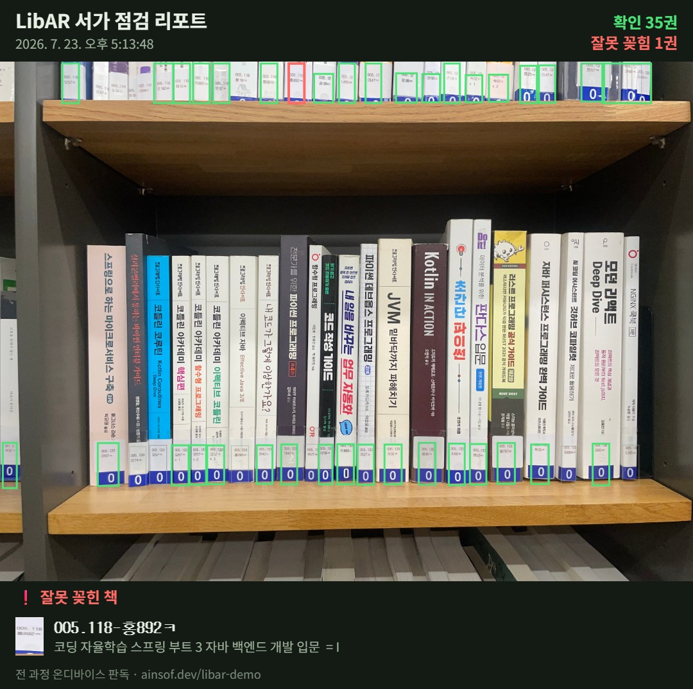

# LibAR — 스마트폰 카메라로 서가를 읽는 온디바이스 AI

<p align="center">
  
</p>

<p align="center">
  <b>🔗 라이브 데모: <a href="https://ainsof.dev/libar-demo/">ainsof.dev/libar-demo</a></b> — 폰 브라우저에서 바로 실행, 설치 불필요<br>
  촬영 화면은 폰 밖으로 나가지 않습니다 (전 과정 온디바이스 · 서버 0원)
</p>

서가를 비추면 AI가 책등의 청구기호를 읽고 장서목록과 대조합니다.
**사서에게는 잘못 꽂힌 책(🔴)을, 이용자에게는 찾는 책(📍)과 추천·인기 도서(⭐🔥)를** 눈앞의 서가 위에 바로 표시합니다.

> 2026 도서관 데이터 활용 공모전 출품작 · 실증: 영등포구립 대림도서관 (현직 사서와 8주 협업)

## 핵심 수치 (전부 실측)

| 항목 | 결과 |
| :--- | :--- |
| 판독 정확도 (서가를 걸으며 스캔) | **99%** (86/87권, 공식 채점) |
| 확인 판정 정답률 | 97% |
| 도서 위치 추정 (도서찾기) | **100%** (273건 전건 적중) |
| 사진 1장 점검 속도 | 16권 / 약 8초 |
| 대조 장서 | 20,944권 (실증관 전 장서) |
| 서버·장비 비용 | **0원** (정적 호스팅 + 온디바이스 추론) |

## 무엇이 다른가

- **데이터가 실물 위에** — 전국 대출 빅데이터(정보나루)와 국립중앙도서관 사서추천이 목록 화면이 아니라 서가 위 핀으로 보입니다
- **장비 0원** — RFID·스마트 서가와 달리 태그도 전용 설비도 없이, 스마트폰과 장서 데이터만으로 동작합니다
- **개인정보 원천 차단** — AI 3종(검출·인식·판정)이 전부 브라우저 안에서 실행되어 촬영 화면이 어디로도 전송되지 않습니다
- **제안이 아니라 실물** — 모든 수치는 실증 도서관에서 측정했고, 지금 공개 데모가 운영 중입니다

## 아키텍처

```mermaid
flowchart LR
    A[📷 카메라 / 사진] --> B["라벨 검출<br>YOLO26n (자체 학습 7,000박스)"]
    B --> C["청구기호 인식<br>PP-OCRv5 (실측 라벨 파인튜닝)"]
    C --> D["장서 대조<br>퍼지 매칭 + 제목 이중인식 + 행 문맥 검증"]
    D --> E["오배열 판정<br>LIS 순서 분석"]
    E --> F[🟢🔴📍 AR 오버레이]
    subgraph 전부 폰 브라우저 안 — ONNX Runtime Web
    B; C; D; E
    end
    G[("장서 20,944권<br>정보나루·국중 추천<br>(정적 JSON)")] -.-> D
    F -.-> H["점검 리포트<br>→ 사서 PC 대시보드"]
```

백엔드 없음: GitHub Pages 정적 호스팅이 전부이고, 유일한 외부 전송은 사서가 명시적으로 보내는 점검 리포트(팀 드라이브)뿐입니다.

## 기술 스택

| 구분 | 기술 | 비고 |
| :--- | :--- | :--- |
| 라벨 검출 | Ultralytics YOLO26n → ONNX (4.5MB) | 실증관 사진 7,000여 박스 자체 구축·전이학습 |
| 문자 인식 | PaddleOCR korean PP-OCRv5 → ONNX fp16 (48MB) | 실측 라벨 702줄+합성 데이터 파인튜닝, 압축 손실 0 검증 |
| 실행 환경 | ONNX Runtime Web (WebGPU / WASM 자동 폴백) | 단일 HTML SPA, 설치·서버 없음 |
| 판정 논리 | 퍼지 매칭 + 제목 이중인식 + LIS + 행 문맥 검증 | Python↔JS 골든 파리티 144/144 |
| 품질 게이트 | 자동 검사 17종 (`webdemo/tests/run_all.mjs`) | 전부 PASS여야 배포 — 새 경로엔 테스트 동승 규칙 |

## 개발 기록 — 실패까지 포함한 서사

8주간의 실증 리포트가 [`libar-sample/팀공유리포트/`](libar-sample/팀공유리포트/)에 날짜순으로 쌓여 있습니다. 성공만 고르지 않았습니다:

- [rec 파인튜닝 v5–v7 회고](libar-sample/팀공유리포트/팀공유_rec학습실험_v5-v7_회고_260718.md) — **4연속 기각**으로 파인튜닝 축을 종결한 기록. 정확도 89→99%의 마지막 도약은 재학습이 아니라 매칭 로직 수술에서 나왔습니다
- [걷기 스캔 실증 → v4 채택](libar-sample/팀공유리포트/팀공유_걷기스캔실증_v4채택_260711.html) · [하이브리드 전 지형 우세](libar-sample/팀공유리포트/팀공유_하이브리드M3_전지형우세_260713.html) · [최종 모델·로직](libar-sample/팀공유리포트/팀공유_최종모델로직_260726.html)
- [개발일지 아카이브](libar-sample/팀공유리포트/개발일지_아카이브_260720시점.md) — 주차별 상세 타임라인

## 저장소 지도

| 경로 | 내용 |
| :--- | :--- |
| [`libar-sample/webdemo/`](libar-sample/webdemo/) | **서비스 본체** — 온디바이스 웹앱(app.html), 판정 모듈(libar_rec.js), 배포 게이트 17종(tests/) |
| [`libar-sample/팀공유리포트/`](libar-sample/팀공유리포트/) | 실증 리포트·회고·현장 사진 (개발 서사) |
| `libar-sample/*.py, *.ipynb` | 모델 학습·평가·실험 스크립트 (연구 트랙) |
| [`Library_AR_Book_Detection_PRD.md`](Library_AR_Book_Detection_PRD.md) | 제품 요구사항 정의서 |
| `scripts/` | 원고 생성 등 보조 도구 |
| [ain0633/libar-demo](https://github.com/ain0633/libar-demo) | 공개 데모 배포본 (GitHub Pages) |

## 데모 사용법

1. 폰 브라우저에서 <https://ainsof.dev/libar-demo/> 접속
2. **샘플 서가** 버튼 — 실증관 서가 사진으로 검출→인식→판정 전 과정 체험
3. **서가 점검하기** — 실시간 카메라 검출 (책이 꽂힌 아무 책장이나)
4. **도서찾기** — 검색·추천도서·인기대출 탭에서 책을 고르면 층별 지도 길안내 → 서가 스캔으로 📍 핀

---

라이선스·데이터: 장서 데이터는 실증 도서관 제공분이며, 모델·코드의 외부 사용은 문의 바랍니다.
