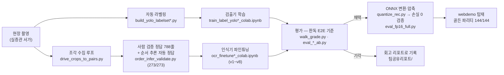

# LibAR 연구 트랙 — 데이터 구축 → 학습 → 평가 → 채택/기각

서비스 본체는 [`webdemo/`](webdemo/)에 있고, 이 폴더의 나머지는 그 본체에 실린 모델과 판정 로직을
만들고 검증한 실험 기록입니다. **모든 채택/기각은 현장 평가셋 기준 A/B로 판정**했고, 기각된 실험도
스크립트·노트북을 그대로 남겨 재현 가능하게 했습니다.

## 데이터 → 학습 → 평가 파이프라인

## 실험 계보 — 무엇을 채택하고 무엇을 버렸나

| 실험 | 판정 | 근거 | 코드 |
| :--- | :--- | :--- | :--- |
| 검출기: 휴리스틱 → YOLO26n 전환 | ✅ 채택 | 하이브리드가 전 지형 우세 (광각 27권·각도 20권, +7·×2.2) | [train_label_yolo_colab.ipynb](train_label_yolo_colab.ipynb) · [daelim_yolo_pipeline.py](daelim_yolo_pipeline.py) |
| 검출기 v4 재학습 | ❌ 미채택 | 미판독의 진범은 검출이 아니라 매칭 로직 — 매칭 수술로 89→99% 해결 | [train_label_yolo_v4_colab.ipynb](train_label_yolo_v4_colab.ipynb) · [diag_v4.py](diag_v4.py) |
| 검출기 v5 (박스 완화+하드 네거티브) | ❌ 기각 | 검출 지표는 우세(오탐 30%↓)였지만 **판독 E2E가 14→12권** — 교체 판정은 E2E로 | [eval_det_v5_ab.py](eval_det_v5_ab.py) |
| rec 파인튜닝 v1~v4 | ✅ v4 채택 | 실측 라벨 702줄 층화 학습, 사진·걷기 총합 신기록으로 단일 모델 통일 | [ocr_finetune_colab.ipynb](ocr_finetune_colab.ipynb) ~ [v4](ocr_finetune4_colab.ipynb) |
| rec v5 | ❌ 기각 | 소급 정답 오염 — "수치가 좋아질 때만 배포" 원칙 첫 작동 | [ocr_finetune5_colab.ipynb](ocr_finetune5_colab.ipynb) |
| rec v6·v7 | ❌ 기각 | 선택 편향 → 정보 한계로 수렴 ([회고 리포트](팀공유리포트/팀공유_rec학습실험_v5-v7_회고_260718.md)) | [eval_v6_ab.py](eval_v6_ab.py) · [eval_v7_ab.py](eval_v7_ab.py) |
| rec v8 (고해상 재료 재도전) | ❌ 기각 · **축 종결** | 정보 한계 해소 후에도 하락 = 병목은 학습량. 4연속 기각으로 파인튜닝 축을 닫고 성장 축을 로직·픽셀·UX로 확정 | [eval_v8_ab.py](eval_v8_ab.py) · [eval_v8_diff.py](eval_v8_diff.py) |
| fp16 압축 | ✅ 채택 | 현장 평가셋 전수 비교 손실 0 | [webdemo/quantize_rec.py](webdemo/quantize_rec.py) · [eval_fp16_full.py](eval_fp16_full.py) |
| 위험도 예측 (오배열 × 구간 특성) | ✅ 채택 | 177구간 점수화 — 실제 문제 9곳 중 7곳이 상위 절반 | [mashup_risk.py](mashup_risk.py) |

> 정확도 89→99%의 마지막 도약은 **재학습이 아니라 매칭 로직 수술**에서 나왔습니다.
> "더 학습시키면 좋아지겠지" 류의 방법 5가지를 실험으로 전부 기각한 기록이 위 표입니다.

## 폴더 지도

| 무엇 | 어디 |
| :--- | :--- |
| **서비스 본체** (웹앱·판정 모듈·배포 게이트 17종) | [`webdemo/`](webdemo/) — app.html · libar_rec.js · tests/run_all.mjs |
| **실증 리포트·회고** (날짜순 개발 서사) | [`팀공유리포트/`](팀공유리포트/) |
| 데이터 구축 | `build_yolo_labelset*.py` · `drive_crops_to_pairs.py` · `pair_align_harvest.py` · `gen_synth_labels.py` · `make_label_batch.py` |
| 학습 (Colab GPU) | `train_label_yolo*_colab.ipynb` (검출) · `ocr_finetune*_colab.ipynb` (인식 v1~v8) |
| 평가·채점 | `walk_grade.py` (공식 채점기) · `eval_*_ab.py` (A/B) · `order_infer_validate.py` (위치 추정 273/273) |
| 변환·이식 검증 | `onnx_validate.py` · `webdemo/quantize_rec.py` · `webdemo/test_rec_parity.py` · `webdemo/make_golden.py` |
| 판정 파이프라인 (Python 원본) | `daelim_yolo_pipeline.py` (하이브리드) · `libar_ondevice.py` (매칭+LIS) · `daelim_closeup.py` (휴리스틱 비교군) |
| 운영 도구 | `dash_build.py` (사서 PC 점검 대시보드) · `fetch_popular.py`/`fetch_recommend.py` (공공 API 오프라인 갱신) · `make_*_report.py` (리포트 생성기) |

## 재현 안내

모델 가중치·현장 사진·실제 장서 데이터는 용량·제공처 정책상 저장소에 없습니다 (`books.csv`는 가상 검증용 샘플).
동작 확인은 [공개 데모](https://ainsof.dev/libar-demo/)에서 즉시 가능하고, 판정 로직의 Python↔JS 일치는
`webdemo/tests/`의 골든 파리티(144/144)로 검증됩니다.

GitHub Actions CI를 두지 않은 것은 의도적 선택입니다 — 배포 게이트 17종이 실제 장서 데이터와
모델 가중치(비공개 자산)에 묶여 있어, CI화하려면 도서관 제공 데이터를 공개해야 합니다.
대신 "게이트 전부 PASS 후에만 배포" 규칙을 커밋 메시지에 매번 기록하는 것으로 대신합니다.
