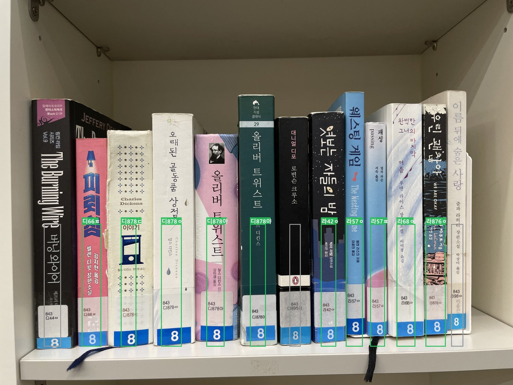
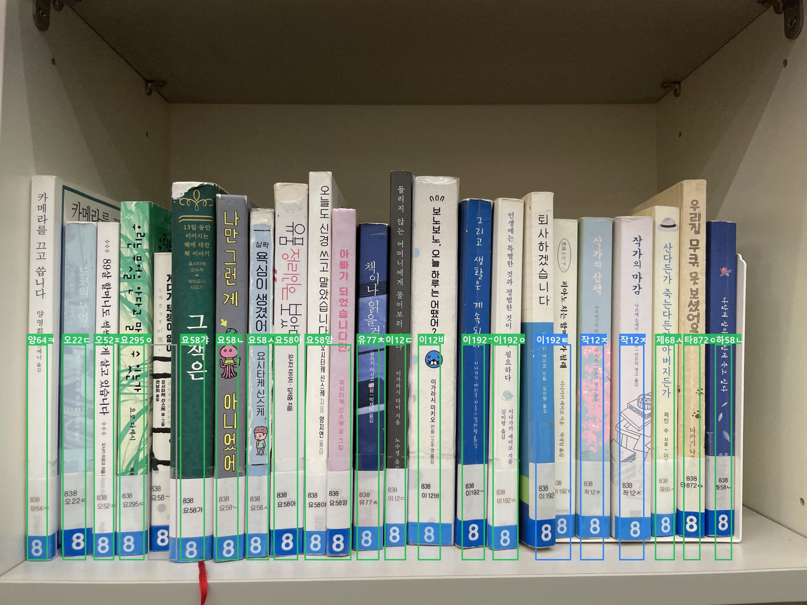
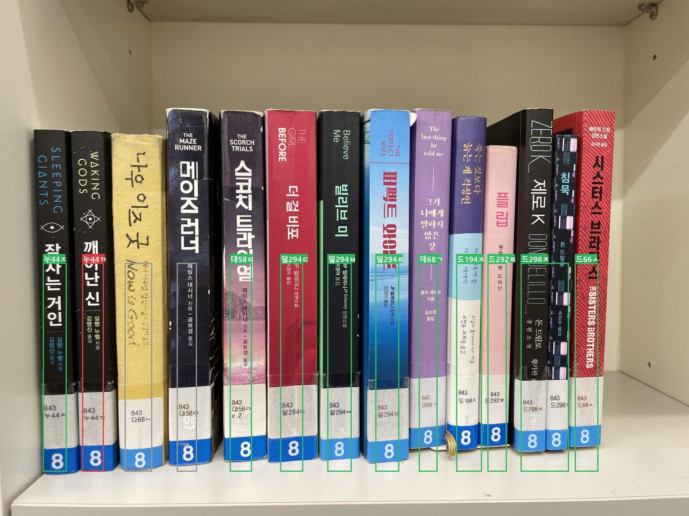
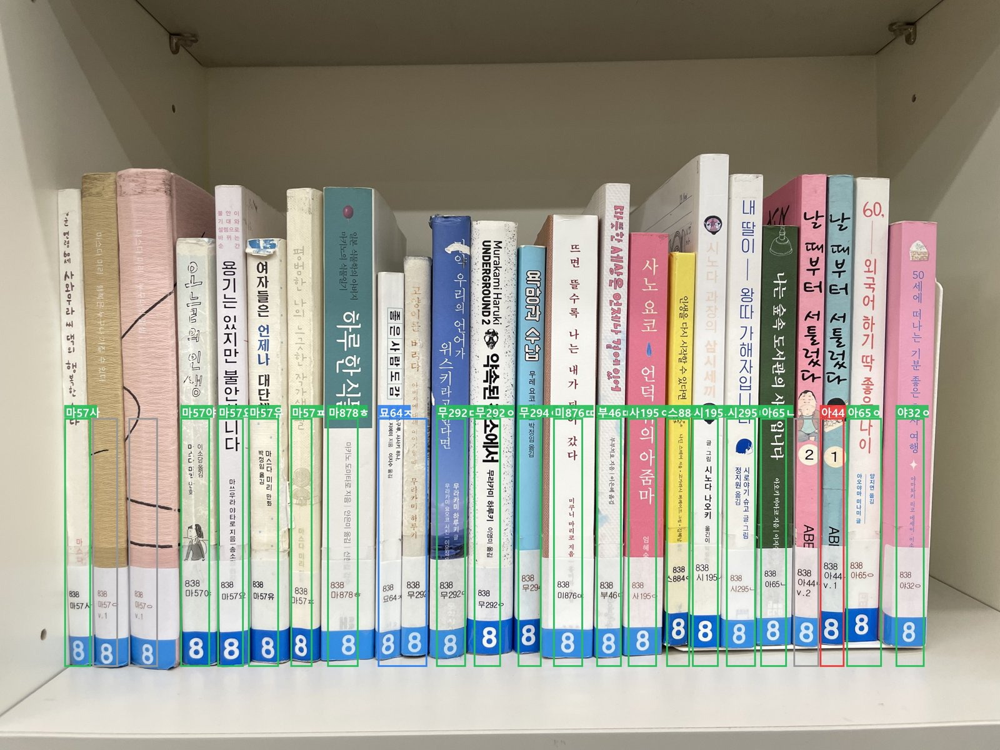
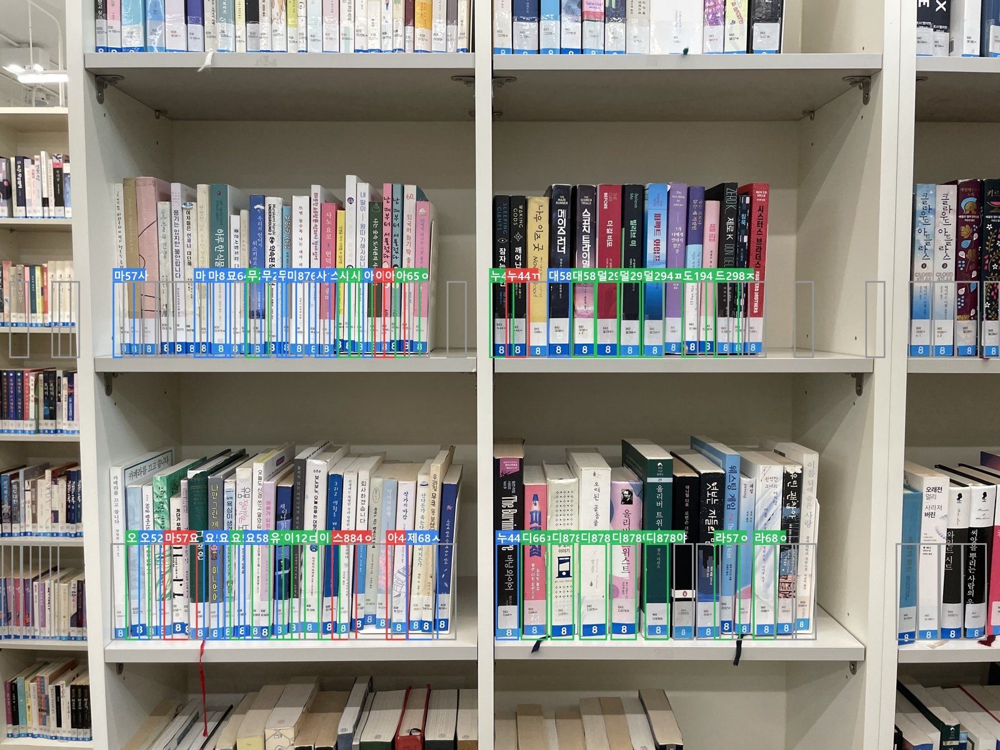

# LibAR 근접 vs 광각 인식 비교 리포트 (2026-07-08)

> **같은 서가 4단(책 ~70권)**을 ① 근접 4장(한 단씩)과 ② 광각 1장(전체)으로 각각 인식한 결과 비교.
> 인식기: 합성 저해상 라벨 5,883장으로 파인튜닝한 OCR + 이원화(라벨=파인튜닝/제목=범용) 파이프라인.

**바운딩 박스 색 범례**
- 🟩 초록 = 청구기호 직독 매칭
- 🟦 파랑 = 제목으로 복구 매칭 (라벨 판독 실패 시 책등 제목 사용)
- 🟥 빨강 = **오배열 의심** (청구기호 배열 순서 위반)
- ⬜ 회색 = 미인식/기권

---

## 1. 근접 촬영 4장 — 한 단이 프레임에 꽉 차게

### 사진 _00 (843 디44~라98 구간, 13권)

| 매칭 | 직독/제목복구 | 미매칭 | 오배열 |
|---|---|---|---|
| 10/13 | 10 / 0 | 3권 — **전부 장서 목록에 없는 책** (디44ㅂ·디895라·라98ㅇ) | 0 |

- `디878ㅇ / 디878아 / 디878야` 한 글자 차이 3권 완벽 구분

### 사진 _01 (838 양~하 구간, 21권)

| 매칭 | 직독/제목복구 | 미매칭 | 오배열 |
|---|---|---|---|
| 20/21 | 17 / 3 | 1권 — 저자기호 뒷글자 판독 실패 | 0 |

### 사진 _02 (843 누~드 구간, 13권)

| 매칭 | 직독/제목복구 | 미매칭 | 오배열 |
|---|---|---|---|
| 11/13 | 11 / 0 | 2권 — 1권 목록에 없음(다66ㄴ) + 1권 권차 확정 불가로 기권(대58ㅁ) | **1 (진짜)** |

- 🟥 `누44ㄲ(깨어난 신)`이 `누44ㅈ(잠자는 거인)` 뒤에 — 시리즈 읽기 순서로 꽂혀 있으나 청구기호 배열로는 순서 위반

### 사진 _03 (838 마~야 구간, 23권)

| 매칭 | 직독/제목복구 | 미매칭 | 오배열 |
|---|---|---|---|
| 20/23 | 19 / 1 | 3권 — 장서 목록에 동일 청구기호 중복 등록 2(마57ㅇ-1) + 권차 글자 유실 1 | **1 (진짜)** |

- 🟥 `아44ㄴ`(날 때부터 서툴렀다) v.2/v.1이 `아65ㄴ`과 `아65ㅇ` 사이에 **역순으로** 꽂힘 — 육안으로도 확인됨

### 근접 종합
| 지표 | 값 |
|---|---|
| 인식된 고유 도서 | **60권** |
| 미매칭 10건의 내역 | 장서 데이터 문제 6 (목록 부재 4 + 중복 등록 2) · 판독 한계 4 |
| **해결 가능한 책 기준 인식률** | **~98%** |
| 진짜 오배열 검출 | 2건 (전부 실물 확인) |

---

## 2. 광각 1장 — 같은 서가를 3m 거리에서 (라벨 폭 ~40px)

### 단계별 개선 (동일 사진·동일 조건)
| 파이프라인 | 매칭(클러스터) | 고유 도서 |
|---|---|---|
| 기존 OCR, 청구기호만 | 5/88 (6%) | 5권 |
| 파인튜닝 OCR, 청구기호만 | 26/88 (30%) | 26권 |
| **이원화 (파인튜닝 라벨 + 범용 제목)** | **46/88 (52%)** | **42권** |

### 품질 (근접 결과 60권을 정답지로 교차 검증)
- 광각 고유 42권 = **42권 전부 정답** (38권은 근접과 일치, 4권은 근접이 놓친 것을 광각이 맞춤)
- **근접에서 확인한 진짜 오배열(누44ㄲ, 아44ㄴ v.2/v.1)을 광각 3m 거리에서 동일하게 검출** 🟥

---

## 3. ❓ 광각에서 제목·청구기호가 함께 보이는 책의 인식률

광각 사진에서 라벨줄이 잡힌 4단의 책은 모두 책등(제목)과 라벨(청구기호)이 동시에 프레임에 들어있음.
근접 촬영으로 확정된 60권을 분모로:

| 기준 | 인식률 |
|---|---|
| 근접 확정 60권 중 광각이 맞춘 책 | **38권 = 63%** |
| 근접이 놓친 걸 광각이 추가로 맞춘 4권 포함 (합산 고유 64권 기준) | **42/64 = 66%** |
| (참고) 청구기호 단독이었다면 | 26권 수준 = ~43% |

**해석: 두 신호가 함께 보이는 책은 광각에서도 3권 중 2권꼴로 인식.** 청구기호가 뭉개져도(40px) 제목이 보완하고, 제목이 가려져도 청구기호가 커버하는 상호 보완 구조가 +20%p를 만듦. 오탐은 0 (고유 기준).

---

## 4. 종합 비교와 시사점

| | 근접 4장 | 광각 1장 |
|---|---|---|
| 촬영 비용 | 단당 1장 (4번 촬영) | **1번 촬영** |
| 인식 (고유 도서) | 60권 (~98%) | 42권 (66%) |
| 오배열 검출 | 2건 + 권차 역순 | **동일 2건 유지** |
| 오탐 | 0 | 0 (고유 기준) |
| 용도 | **정밀 재고조사** (미배가·결번 확정) | **일상 순회 스캔** (오배열 후보 신속 탐지) |

- 운영 시나리오: 평소엔 광각/동영상 스캔으로 오배열 후보를 자동 표시 → 주기적으로 근접 스캔(또는 걷기 촬영)으로 정밀 대조
- 근접 미매칭의 60%가 **장서 데이터 문제**(목록 부재·중복 등록)였다는 점 = LibAR이 인식기이면서 동시에 **장서 DB 품질 검사기**로 작동한다는 증거

*파이프라인: `libar-sample/daelim_closeup.py` · 파인튜닝 모델: `korean_lowres_rec_infer` · 원본 AR 이미지: `libar-sample/out_ondevice/closeup_*_ft_ar.jpg`*
